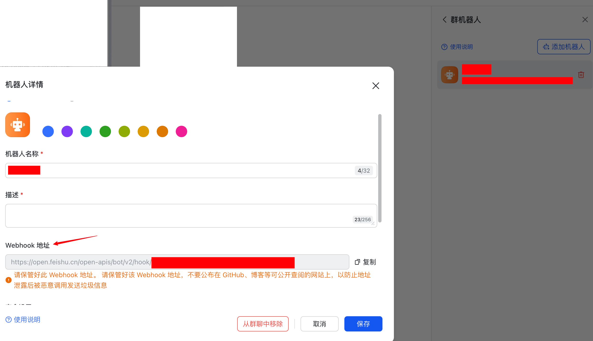

# Feishu Monitor
## 🔍 Overview

Feishu Monitor is a tool designed to monitor and manage activities within the Feishu platform. It provides insights and automation to enhance productivity and streamline workflows.

## ⭐ Features

- 🔄 **Real-time Monitoring**: Track activities and events in real-time.
- 🔔 **Alert Notifications**: Receive instant notifications for important events.

## 🚀 Installation

```bash
pip install git+https://github.com/xwy-bit/feishu-monitor.git
```

## 🛠️ Usage

1. get your feishu app credentials from [feishu](https://www.feishu.cn/hc/zh-CN/articles/360024984973-%E5%9C%A8%E7%BE%A4%E7%BB%84%E4%B8%AD%E4%BD%BF%E7%94%A8%E6%9C%BA%E5%99%A8%E4%BA%BA).


1. login
```bash
feishu login
```
Type your url in the terminal and press enter.

e.g. https://open.feishu.cn/open-apis/bot/v2/hook/abcde-12345-67890-fghij-09876

2. run
```bash
feishu <your_command>
```

e.g. feishu python run.py

## 🤝 Contributing

Contributions are welcome! Please fork the repository and submit a pull request.

## 📄 License

This project is licensed under the MIT License. See the [LICENSE](LICENSE) file for details.

## 📧 Contact

For questions or support, please contact [ustcxwy0271@mail.ustc.edu.cn](ustcxwy0271@mail.ustc.edu.cn).